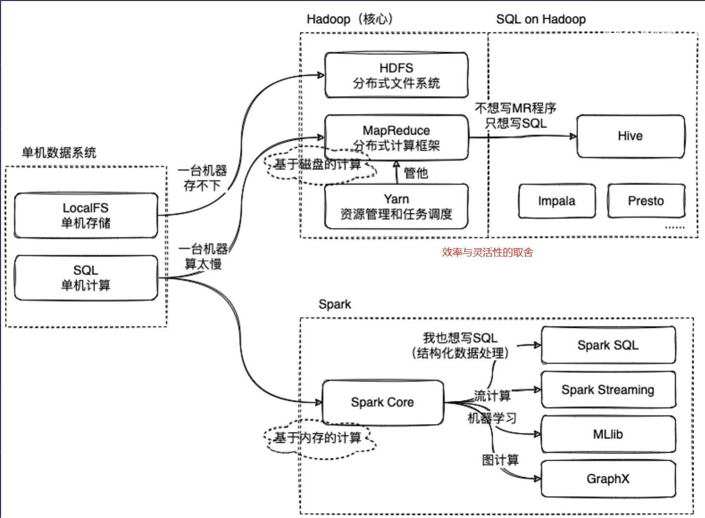

[参考](https://www.bilibili.com/video/BV1LU4y1e7Ve/)

#### 一、Spark介绍 
1、Spark是一个**分布式计算框架**，和Mapreduce的作用一样，完成数据的计算
2、与MapReduce的区别
* spark是基于**内存计算**，会将中间结过存放在内存，方便后续计算的使用。MR会将中间结果存储在磁盘上。
    * 内存数据的读写速度要比磁盘快的多，所以spark的计算速度要比MR快。
    * Presto也是基于内存计算的，Presto不适合海量数据处理，而目不能创建库表。Spark对海量数据在内存上的计算做了优化，内存不足会将结果存在磁盘上，适合海量数据处理，并且可以进行库表创建。
* Spark的计算任务是由**线程**完成的。MR的计算任务是由进程完成的。
    * 线程切换计算任务的速度比进程切换计算任务速度快

3、Spark和MR的计算思想是一样的: 分而治之
4、Spark是由Scala语言编写完成的。Scala语言本质上是对java语言的二次开发，底层还是要依赖java的JVM。
5、Spark是apche基金会下的顶级开源项目

Mapreduce回顾


#### 二、Spark的兼容性
* 支持三方工具接入存储工具
    * hdfs
    * kafka
    * hbase
* 资源调度
    * yarn
    * standalone (spark自带的)高可用
    * zookeeper
* 支持多种操作系统
    * Linux
    * windows
    * Mac


#### 三、Spark 框架


#### 四、Spark部署方式(熟悉)
* Local模式部署。 本地模式部署，需要运维人员部署。
    * 使用一台服务器进行部署，一般用于测试代码，在本地能运行成功的代码在集群下也能运行。
* cLuster模式部署。 集群模式部署，需要运维人员部署。
    * 集群需要多台服务器
    * 多台服务的资源需要同一管理，使用资源调度服务
        * Standalone
        * Yarn
* 云服务 比较省事，可以直接使用。
  * 使用云服务供应商提供的服务
  * 数据可以存储在本地，用云服务连接本地数据源进行计算，在将结果保存在本地
  * 只是使用云服务的计算资源


#### 五、本地部署
本质上就是linux下安装软件
下载文件，解压安装文件，配置环境变量，测试一下（具体可见生信那里）


#### 进入pyspark(数据互相转化)
直接进行python的列表累加计算使用的是单机资源计算，但是，使用spark可以进行分布式计算，利用多台机器资源
```python
data = [1,2,3,4]
type(data) # list
rdd = sc.parallelize(data)  # 将python数据转化成rdd数据
type(rdd) # pyspark.rdd.RDD

rdd.reduce(lambda x,y:x+y) #10 rdd的reduce方法进行数据累加


vim a.py
# 安装
pip install pyspark == 3.1.2 -i https:// (可以不设置版本，-i指定安装源)
# 导入模块
from pyspark import SparkContext

# 生成SparkContext对象
sc = SparkContext() #像个类

# 将python数据转化成rdd数据
data = [1,2,3,4]
rdd = sc.parallelize(data)

# 对rdd进行计算
res = rdd.reduce(lambda x,y:x+y)

# 输出结果
print(res)

```

为什么pyspark可以而python3 a.py不行(在没有pip install pyspark之前)?

```shell
a=10
echo ${a}
```

通过vscode/pycharm配置远程环境(目的：远程开发)
1. ssh
2. python环境配置
3. SFTP配置
4. 数据库配置
   

环境问题解决：


### 集群模式
集群模式搭建需要多台服务器
node1，node2，node3

---
多台服务器的资源需要统一管理，就要部署资源调度服务资源调度服务
standalone (spark自带的服务) yarn (Hadoop的)

---
现在要保证三台服务器的基础环境一致
都要有java和Python环境
都要安装hadoop，zookeeper

---
在node1进行spark配置，将配置好的安装包scp拷贝到其他服务器，保证多台服务器中的spark配置是一致


* standalone是spark的资源调度服务
  * 作用和yarn和一样的
* standalone运行时的服务
    * master 主服务 管理整个资源调度，资源的申请需要通过master进行分配
      * 类似于yarn中的ResourceManager
      * master只有一个，是单点故障
    * worker 从服务 根据master的分配，创建资源空间给计算任务使用
      * 类似于yarn中的nodemanager
      * worker可以运行在多台服务器上 
* standalone部署时的服务指定
    * node1 运行master和worker
    * node2 运行worker
    * node3 运行worker
